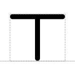
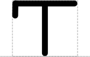
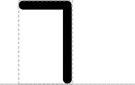
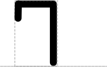
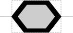
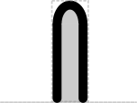
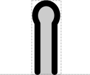

# Terminator

## Associated SO term(s)
SO:0000141: Terminator

## Recommended Glyph and Alternates
The terminator is a T sitting atop the backbone:

A number of variants have been proposed.  Some add asymmetry by:

- Adding a "blocking" line handing down on the left: 

- Cutting the terminator in half:

- Or doing both:

Other variants make function more symbolic by:

- Looking somewhat like a stop sign (from the iGEM registry):

- Diagramming some sort of hairpin- or loop-like structure:

## Prototypical Example

T1 terminator

## Notes
*this section deliberately blank*
