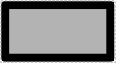
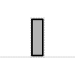
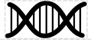
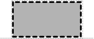
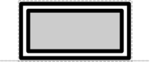
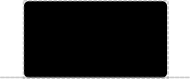

# Unspecified, No Glyph Assigned, Composite

## Associated SO term(s)
Unspecified: SO:0000110 Sequence Feature

No glyph assigned: Any SO term that is not covered by any glyph besides the root Sequence Feature

Composite: SO:0000804 Engineered Region

## Recommended Glyph and Alternates

Currently, all three of these meanings are covered by the "User Defined" glyph, a plain rectangle suggesting a blank slate to be written upon:

A number of potential replacement glyphs and variants have been proposed for covering Unspecified and/or No Glyph Assigned.  These are:

* The unicode "replacement character" glyph, indicating a missing or invalid symbol:
* A tall thin rectangle, which some fonts use as an alternative "replacement character":

  
* A piece of DNA: 

  
* A horizontal line:
* A horizontal line with a question mark over it:
* A dashed line rectangle, implying something is missing:

  
* A rectangle with an X through it:

  
* A half-rounded rectangle, the SBGN glyph for a nucleic acid:

  

For Composite the following glyphs have been proposed:

* Dashed "expanding lines" connecting a point of the backbone to a backbone diagramming the contents of the composite:
* Dashed "expanding lines" connecting an Omitted glyph (one candidate shown here for an example) to a backbone diagramming the contents of the composite:
* Dashed "expanding lines" connecting two bars to a backbone diagramming the contents of the composite: 
* A double rectangle:

* A "black box":

## Prototypical Example

Unspecified: an anonymous sequence that is missing any information about its nature or intended purpose.

No Glyph Assigned is intended to be used for any Component that is not covered by other SBOL Visual glyphs.

Composite: an "expression cassette" containing a ribosome entry site, coding sequence, and terminator.

## Notes
The Unspecified glyph is intended for showing where a sequence's role is missing (or, equivalently, given only the uninformative "Sequence Feature" root role). It should never appear with well-curated designs or diagrams.

No Glyph Assigned is intended for constructs with a defined specific role that happens to not yet be covered by available approved glyphs (other than the root "Sequence Feature"). It is more likely to appear in machine-generated diagrams than in human-generated diagrams, since humans are likely to invent and use their own glyph for the purpose.

Some of the proposed glyphs for Composite are linked to the proposal for an Omitted Detail glyph.