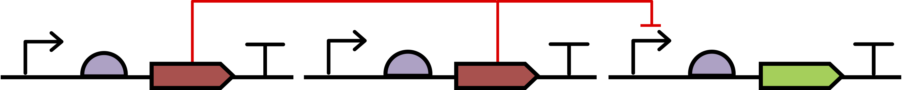
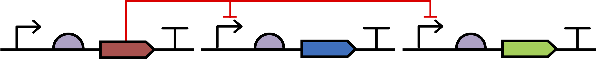
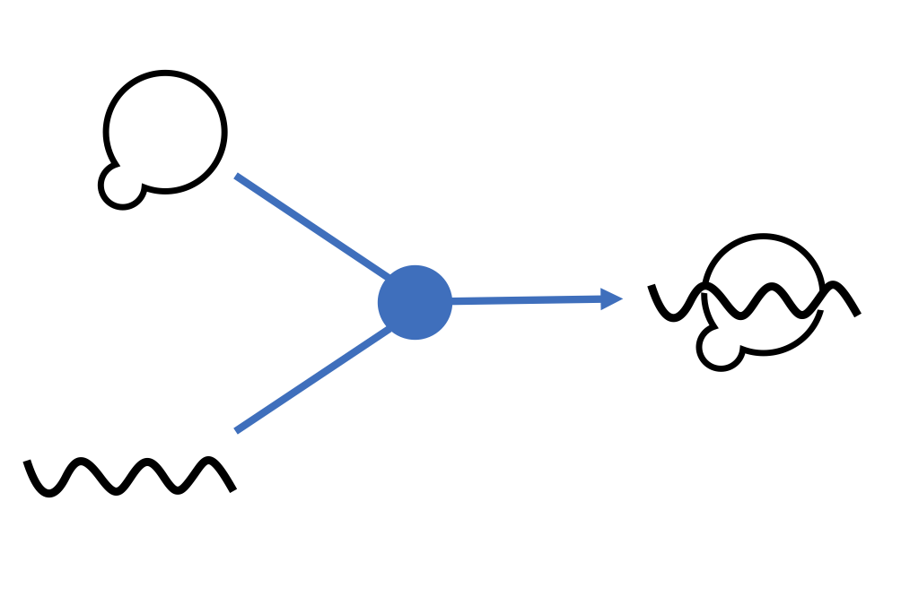
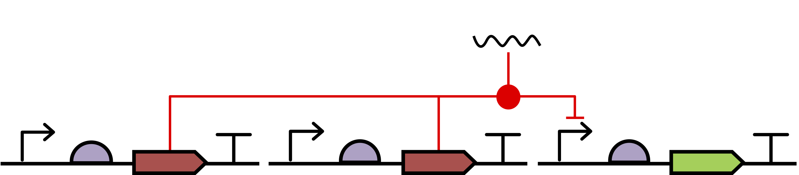
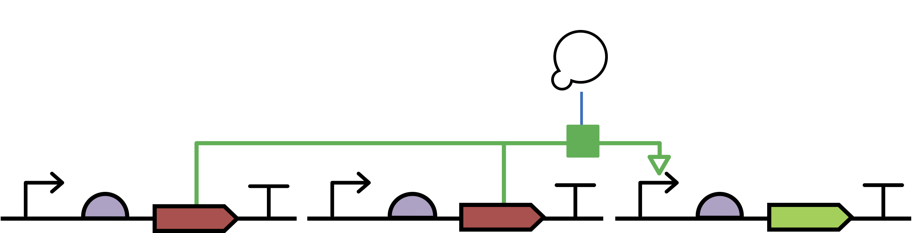
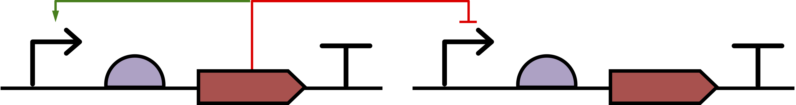

# SEP V013: Multi-source and multi-target arrows

| SEP | |
| --- | --- |
| **Title** | Multi-source and multi-target arrows |
| **Authors** | Thomas Gorochowski, Jacob Beal |
| **Editor** |  |
| **Type** | Specification |
| **SBOL Visual Version** | 2.1 |
| **Status** | Accepted |
| **Created** | 23-Aug-2018 |
| **Last modified** | 4-Nov-2018 |
| **Issue** | [#47](https://github.com/SynBioDex/SBOL-visual/issues/47) |

## Abstract

This SEP proposes to provide meaning to the splitting and joining of lines connecting elements in a diagram.

## Table of Contents
- [1. Rationale](#rationale) 
- [2. Specification](#specification)
- [3. Example or Use Case](#example)
- [4. Backwards Compatibility](#compatibility)
- [5. Discussion](#discussion)
- [References](#references)
- [Copyright](#copyright)

## 1. Rationale 

The SBOL Visual 2.0 standard defines no formal meaning when lines connecting components split or join. This has led to these features being used to serve several different meanings and adding confusion to the interpretation of a diagram (e.g., one species that has multiple sources or multiple points of effect, and chemical reactions that combines multiple species into one or split one species into many). To ensure consistency and an ability to be explicit about the processes taking place, it is essential that clear guidelines are provided. We would also as much as possible like to adhere to standards already proposed in the SBGN-PD language.

## 2. Specification 

The specification will be modified with additions to the definition of Interactions and an addition of three "Interaction Node" glyphs imported from SBGN-PD.

### Extension to Interaction definition

An edge may have multiple heads or multiple tails. 
In this case, a split or join in an edge represents either multiple participants with the same role (e.g., a transcription factor repressing two instances of a promoter) or a biochemical process (e.g., association of an inducible protein and a small molecule to form an active complex).  
An edge with multiple heads MUST use the same glyph for each head.
An edge that splits or joins with no glyph at the junction represents multiple participants with the same role.
A glyph at the point where an edge splits or joins represents a biochemical process, i.e., an additional Interaction with type and roles set by the process glyph. 

A biochemical process represented by a glyph at an edge junction SHOULD be represented using a glyph defined in the Interaction Node Glyphs Appendix. In this case, the interaction type MUST be contained within at least one of the glyph's associated terms.
In terms of the SBOL 2 data model, this means the glyph is equal to or a parent of at least one of the types for the Interaction, and that each associated Participation object has a role compatible with its position on the head or tail of the edge.
	Moreover, the glyph used SHOULD be the RECOMMENDED variant of the most specific applicable glyph.  Note that novel glyphs not defined in the appendix MAY be used, but SHOULD be proposed for adoption.

### Examples

Examples of use of multi-head and multi-tail arrows: 
Repression from multiple independent sources:

Repressor with multiple targets:

Association of gRNA and Cas9 into an active CRISPR complex and the dissociation of that complex:

Composite edges representing two interactions: CRISPR complex formation with Cas9 from two sources, which then represses a promoter.

Phosphorylation of an inactive transcription factor (produced by two different CDSs) by a kinase to form an active transcriptional activator, which then stimulates a promoter:

Multi-head interactions, however, MUST NOT use different glyphs for different heads, so images like the one below are forbidden:

### Interaction Node Glyphs

These glyphs are placed at the junctions of edges to represent biochemical processes, and include a bounding box (grey dashed box) but are not connected to any nucleic acid backbone. Grey dashed lines provide examples of how edges may connect to the glyph.

#### Association

##### Associated SBO term(s)
SBO:0000177 Non-Covalent Binding

##### Recommended Glyph and Alternates
A circular node:

##### Prototypical Example

Association of gRNA and Cas9 to form an active CRISPR complex.

##### Notes
The association glyph is based on the SBGN Process Description association glyph.

#### Dissociation

##### Associated SBO term(s)
SBO:0000180 Dissociation

##### Recommended Glyph and Alternates
An circular node inside another circle

##### Prototypical Example

Dissociation of an active CRISPR complex into gRNA and Cas9.

##### Notes
The dissociation glyph is based on the SBGN Process Description dissociation glyph.

#### Process

##### Associated SBO term(s)
SBO:0000375 Process

##### Recommended Glyph and Alternates
A square node:

##### Prototypical Example

Association of gRNA and Cas9 to form an active CRISPR complex.

##### Notes
The process glyph is based on the SBGN Process Description process glyph.

The assocated SBO term also covers:

- SBO:0000176 Biochemical Reaction
- SBO:0000177 Non-covalent Binding (sink is a Complex)

## 3. Examples 

See individual examples of each case in the specification section.

## 4. Backwards Compatibility 

No backward compatibility issues as SBOL Visual does not currently define any meaning for the splitting and joining lines connecting elements in a diagram.

## 5. Discussion 

## Copyright 

  
   
  To the extent possible under law,
  <a rel="dct:publisher"
     href="sbolstandard.org">
    SBOL developers</a>
  has waived all copyright and related or neighboring rights to
  SEP V001.
This work is published from:

  United States.

