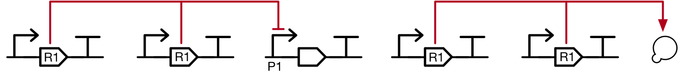
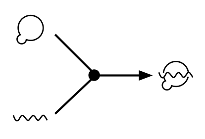
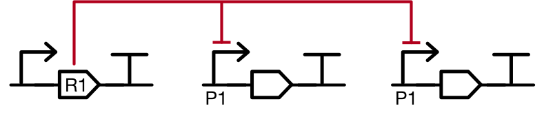
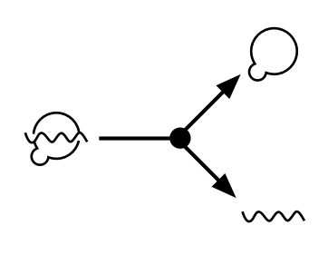

# SEP V013: Multi-source and multi-target arrows

| SEP | |
| --- | --- |
| **Authors** | Thomas Gorochowski |
| **Editor** |  |
| **Type** | Specification |
| **SBOL Visual Version** | 2.1 |
| **Status** | Draft |
| **Created** | 23-Aug-2018 |
| **Last modified** | 23-Aug-2018 |
| **Issue**         | [#47](https://github.com/SynBioDex/SBOL-visual/issues/47) |

## Abstract

This SEP proposes to provide meaning to the splitting and joining of lines connecting elements in a diagram.

## Table of Contents
- [1. Rationale](#rationale) 
- [2. Specification](#specification)
- [3. Example or Use Case](#example)
- [4. Backwards Compatibility](#compatibility)
- [5. Discussion](#discussion)
- [References](#references)
- [Copyright](#copyright)

## 1. Rationale 

The SBOL Visual 2.0 standard defines no formal meaning when lines connecting components split or join. This has led to these features being used to serve several different meanings and adding confusion to the interpretation of a diagram (e.g., one species that has multiple sources or multiple points of effect, and chemical reactions that combines multiple species into one or split one species into many). To ensure consistency and an ability to be explicit about the processes taking place, it is essential that clear guidelines are provided. We would also as much as possible like to adhere to standards already proposed in the SBGN-PD language.

## 2. Specification 

### Multi-source arrows

#### Multiple sources of a production

If a species or interactions has multiple sources of production then lines from these can join to allow for a single arrowhead connecting to the target.

#### Formation of a species from many others

If multiple source elements combine (e.g., complex formation) to produce a new species or act together for regulation, then lines can be joined, but the junction MUST be annotated with a process glyph, as per SBGN.  For example, SBGN uses a circle to indicate association of species into a complex, which can be used to show CAS9 combining with gRNA as in the diagram below:

### Multi-target arrows

#### Multiple points of effect

If a species or interaction has many targets then an arrow can split to allow a single starting point connect to multiple target.

#### Splitting of one species into many others

If a species breaks down into multiple parts then an arrow can split to connect these sub-components, but the junction MUST be annotated with process glyph, as per SBGN.  For example, the dissociation of gRNA from CAS9 can be indicated with the aid of a "double-circle" SBGN dissociation glyph:

## 3. Examples 

See individual examples of each case in the specification section.

## 4. Backwards Compatibility 

No backward compatibility issues as SBOL Visual does not currently define any meaning for the splitting and joining lines connecting elements in a diagram.

## 5. Discussion 

## Copyright 

  
   
  To the extent possible under law,
  <a rel="dct:publisher"
     href="sbolstandard.org">
    SBOL developers</a>
  has waived all copyright and related or neighboring rights to
  SEP V001.
This work is published from:

  United States.

