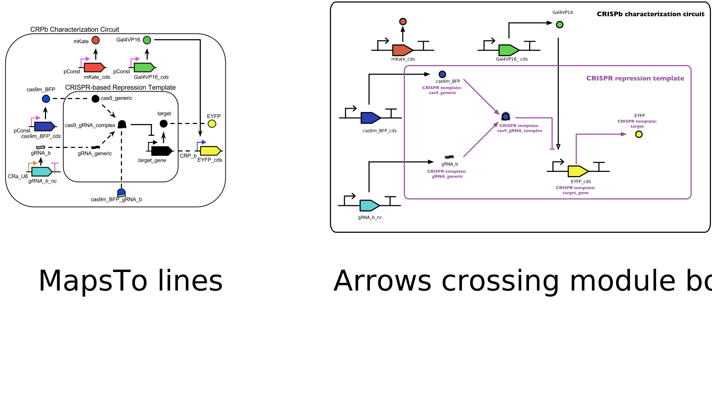

# SEP V014: Modules and MapsTo

| SEP | |
| --- | --- |
| **Authors** | James Scott-Brown (james@jamesscottbrown.com) |
| **Editor** |  |
| **Type** | Specification |
| **SBOL Visual Version** | 2.1 |
| **Status** | Draft |
| **Created** | 18-Jul-2018 |
| **Last modified** | 20-Jul-2018 |
| **Issue**         | [#48](https://github.com/SynBioDex/SBOL-visual/issues/48) |

## Abstract

Modules and MapsTo relations were introduced in version 2 of the SBOL data model specification, but the SBOL Visual standard currently says nothing about how these should be visually represented in a diagram. 

This SEP suggests that modules be visually represented by enclosure, with either arrows or lines indicating MapsTo relations crossing the module border.

## Table of Contents  <remove TOC if SEP is rather short>
- [1. Rationale](#rationale) 
- [2. Specification](#specification)
- [3. Example or Use Case](#example)
- [4. Backwards Compatibility](#compatibility)
- [5. Discussion](#discussion)
- [References](#references)
- [Copyright](#copyright)

## 1. Rationale 

Modules and MapsTo relations were introduced in version 2 of the SBOL data model specification, but the SBOL Visual standard currently says nothing about how these should be visually represented in a diagram.

## 2. Specification 

The specification will be modified with addition of a subsection on Modules, plus the inclusion of SBOL 2.0 Module and MapsTo definitions in the vocabulary.

### Vocabulary

The following will be added to the vocabulary section, copied from the SBOL 2 specification:

* _MapsTo:_ When a design (ComponentDefinition or ModuleDefinition) includes another design as a sub-design, the parent design might need to refer to a ComponentInstance (either a Component or FunctionalComponent) in the sub-design.
In this case, a MapsTo needs to be added to the instance for the sub-design, and this MapsTo needs to link between the ComponentInstance in the sub-design and a ComponentInstance} in the parent design.

* _Module:_ Pointer class. Incorporates a child ModuleDefinition by reference into exactly one parent ModuleDefinition. Represents a specific occurrence or instance of a subsystem within the design of a larger system. Because the same definition in multiple designs or multiple times in a single design, a single ModuleDefinition can have zero or more parent ModuleDefinitions, and each such parent-child link requires its own, distinct Module.

### Representation of modules 

The representation of modules in a diagram is OPTIONAL. In some cases, it may be important to directly communicate hierarchical structure, whereas in other cases the use of modules may be a detail of how a design is represented in the SBOL data model that would simply add clutter and confusion if included in a diagram. The decision about whether to represent modules should be based upon consideration of the intended reader of the diagram, and what the user intends to communicate to them.

If modules are represented, then they SHOULD be represented by enclosure in a closed curve or polygon; it is RECOMMENDED that this shape be a rectangle or a rounded rectangle. Rectangular protrusion MAY be drawn from this to represent input/output ports: if a line or arrow connects to the outside of a port, it should be interpreted as being directly connected to any glyph inside the module that is connected to the inside of the same port. If arrows connect to both the outside and inside of a port, then they MUST have consistent directions. A port MUST NOT be connected to more than one glyph outside of the module, unless all of the glyphs it connects to represent the same entity.

It is OPTIONAL to represent the internal structure of a module: a module can be drawn as a 'black box' with its internal structure hidden. It is RECOMMENDED that a black-box module be larger than other glyphs, to avoid confusion with similarly shaped macromolecule glyphs. It is RECOMMENDED that a black-box module be drawn with ports, as if a line or arrow crosses the boundary of the module at a position other than a port it is impossible to see where it terminates. If a line or arrow crosses a module's boundary other than at a port, it SHOULD be labelled.

If lines indicating MapsTo relations are drawn, then these lines SHOULD be made visually distinct from other lines included in the same diagram. It is RECOMMENDED that this distinction be made by using dashed lines to represent MapsTo relations.
A MapsTo relation MAY be indicated by a line with no arrowhead; alternatively, to visually distinguish between inputs and outputs of a module, a MapsTo relation for the input of a module MAY be drawn with a filled arrowhead directed into the module, and a MapsTo relation for the output of a module MAY be drawn with a filled arrowhead directed out of the module.

As an alternative to depicting MapsTo relations, it is permitted to draw arrows entering a module.
In such a case, the representation of the module does not modify the semantics of the interactions shown: it simply indicates that where the corresponding interaction is defined.
If an interaction arrow is completely enclosed within a module boundary, this SHOULD be interpreted to mean that the corresponding interaction is defined within the corresponding ModuleDefinition.

The positioning of inputs and outputs SHOULD be consistent between modules in the same diagram (e.g. with inputs on the left and outputs on the right, or inputs at the top and outputs at the bottom).

## 3. Examples 

## 4. Backwards Compatibility 

## 5. Discussion 

This SEP is intentionally drafted in a very permissive way, as there are several reasonable ways to represent a module. However, the community may feel that it should be more prescriptive in places.

In particular, some have suggested that it should be REQUIRED to represent MapsTo lines with dashed lines; others object to this as a departure from the previous policy of leaving choice about line style to the user. 

## Copyright 

  
   
  To the extent possible under law,
  <a rel="dct:publisher"
     href="sbolstandard.org">
    SBOL developers</a>
  has waived all copyright and related or neighboring rights to
  SEP V001.
This work is published from:

  United States.

