# SEP V014: Modules and MapsTo

| SEP | |
| --- | --- |
| **Title** | Modules and MapsTo |
| **Authors** | James Scott-Brown (james@jamesscottbrown.com), Jacob Beal |
| **Editor** |  |
| **Type** | Specification |
| **SBOL Visual Version** | 2.1 |
| **Status** | Draft |
| **Created** | 18-Jul-2018 |
| **Last modified** | 4-Nov-2018 |
| **Issue**         | [#48](https://github.com/SynBioDex/SBOL-visual/issues/48) |

## Abstract

Modules and MapsTo relations were introduced in version 2 of the SBOL data model specification, but the SBOL Visual standard currently says nothing about how these should be visually represented in a diagram. 

This SEP suggests that modules be visually represented by enclosure, with lines indicating mapping relations crossing the module border.

## Table of Contents  <remove TOC if SEP is rather short>
- [1. Rationale](#rationale) 
- [2. Specification](#specification)
- [3. Example or Use Case](#example)
- [4. Backwards Compatibility](#compatibility)
- [5. Discussion](#discussion)
- [References](#references)
- [Copyright](#copyright)

## 1. Rationale 

Modules and MapsTo relations were introduced in version 2 of the SBOL data model specification, but the SBOL Visual standard currently says nothing about how these should be visually represented in a diagram.

## 2. Specification 

The specification will be modified with addition of a subsection on Modules, plus the inclusion of SBOL 2.0 Module and MapsTo definitions in the vocabulary.

### Vocabulary

The following will be added to the vocabulary section, copied from the SBOL 2 specification:

* _MapsTo:_ When a design (ComponentDefinition or ModuleDefinition) includes another design as a sub-design, the parent design might need to refer to a ComponentInstance (either a Component or FunctionalComponent) in the sub-design.
In this case, a MapsTo needs to be added to the instance for the sub-design, and this MapsTo needs to link between the ComponentInstance in the sub-design and a ComponentInstance in the parent design.

* _Module:_ Pointer class. Incorporates a child ModuleDefinition by reference into exactly one parent ModuleDefinition. Represents a specific occurrence or instance of a subsystem within the design of a larger system. Because the same definition in multiple designs or multiple times in a single design, a single ModuleDefinition can have zero or more parent ModuleDefinitions, and each such parent-child link requires its own, distinct Module.

### Representation of modules 

A module within a system MAY be represented by a visual boundary in the form of closed polygon or closed curve.
Everything inside of the boundary is part of the module, and everything outside of the boundary is not part of the module; only certain diagram elements are allowed to cross a boundary, as defined below.
In terms of the SBOL 2 data model, the line represents a Module included within the ModuleDefinition represented by the surrounding diagram, and boundary-crossing elements define MapsTo relationships.
Note that the internals of a module need not be shown: some details can be omitted or a module can even be a ``black box'' with no internal structure at all being shown.

#### Boundaries
The boundary of module SHOULD should be a rectangle or rounded rectangle. Boundary sides SHOULD be oriented vertically and horizontally.  It is RECOMMENDED that a module be made visually distinct by making it larger than other glyphs and with a different line style.

Examples of recommended and problematic module boundaries:

Two modules with visually distinct rectangular borders
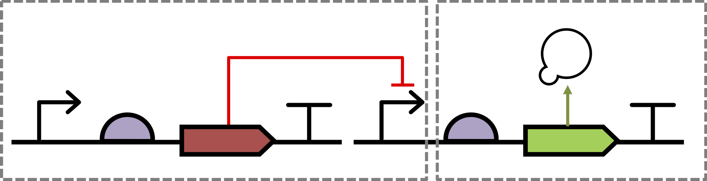

The same modules but with rounded rectangles and the second being a ``black box'' module with no internal structure shown
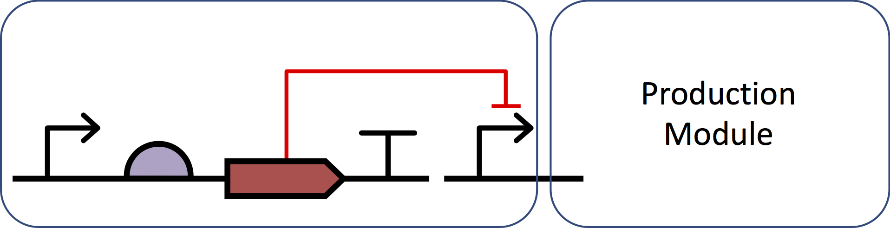

SHOULD NOT: modules with non-rectilinear borders
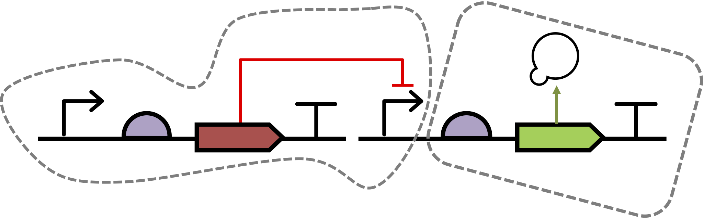

SHOULD NOT: A black-box module that is not visually distinct from a sequence feature glyph.
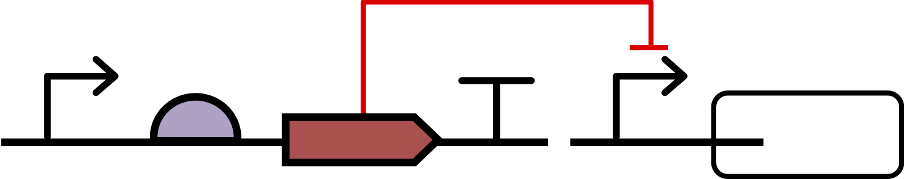

#### Mappings	

An undirected edge (i.e., having no ``arrow head'') that crosses the boundary of a module represents a mapping associating the diagram elements that it links. 
Glyphs associated by a mapping MUST either be sequence features, molecular species, or module ports (see below), and must be of compatible types.
In terms of the SBOL 2 data model, the line represents a MapsTo relationship between a FunctionalComponent in the ModuleDefinition and another FunctionalComponent in the definition of the Module.
	Mapping edges SHOULD be made visually distinct from other lines in the same diagram, and it is RECOMMENDED that this distinction be made using dashed lines to represent mapping edges.

Examples of recommended and problematic mappings: 

Mapping showing that the promoter inside the module on the left is also used in the construct on the right:
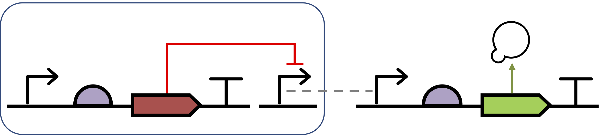

SHOULD NOT: mapping is not visually distinct from nucleic acid backbone
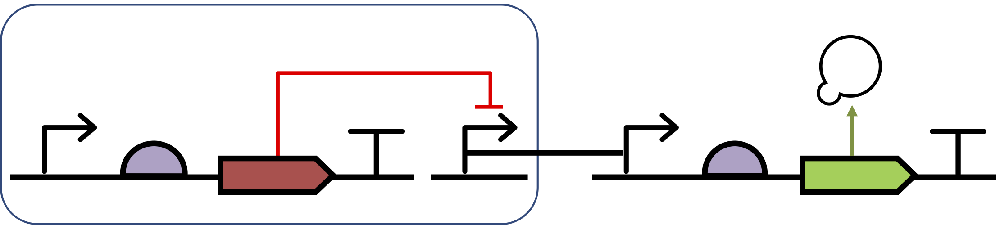

MUST NOT: mapping cannot identify a promoter with a macromolecule species.
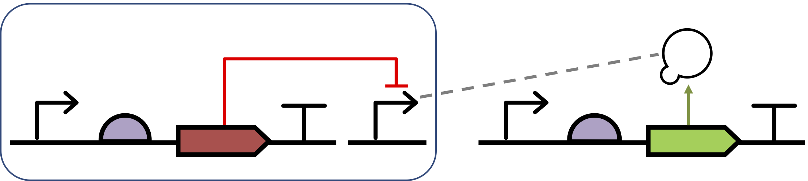

#### Boundary Intersections
Glyphs for sequence features and molecular species MUST NOT intersect with the boundary of a module.
	A nucleic acid backbone MAY cross the boundary of a module. This represents an implicit mapping between the region of the nucleic acid construct contained within the module and a compatible region of the larger construct represented in the enclosing system.
	An interaction edge MAY cross the boundary of a module. This represents an interaction in the enclosing system plus an implicit mapping between the component inside of the module and a compatible instance in the enclosing system.

Examples of recommended and problematic boundary intersections: 

Sequence feature and molecular species glyphs MUST NOT intersect a module boundary: 
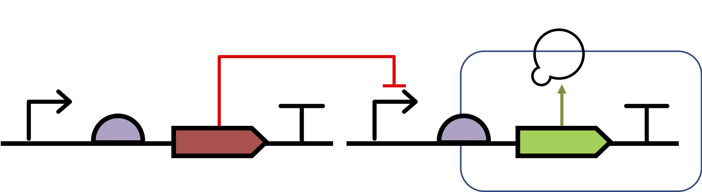

Implicit mapping from the promoter in the left module and the regulated elements in the right module to a nucleic acid construct ordering both into a complete functional unit
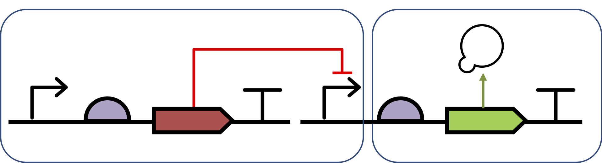

Implicit mapping from the CDS in the left module and the promoter in the right module to instances in the complete system in which the CDS inhibits the promoter (presumably by a repressor product).
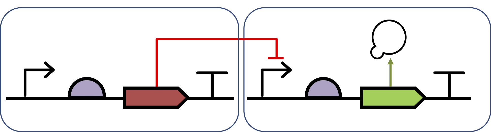

#### Ports

Small rectangles MAY be drawn on the outside of the module boundary to represent input/output ports.
In terms of the SBOL 2 data model, each rectangle is associated with a FunctionalComponent with a direction property that is in, out, or inout.
A port may be connected to interaction edge head or tail to represent interactions with its associated component. 
If both a port and a glyph for its associated component are present in a diagram, then they MUST be visually connected, either explicitly by means of a mapping or implicitly by an interaction that passes through the port rectangle.
Likewise, mappings and interactions with the associated component MUST NOT cross the boundary except through the port.
A port SHOULD NOT both have interactions both connecting to it and crossing the boundary across it.

Examples of recommended and problematic module ports: 

Port on a black-box module:
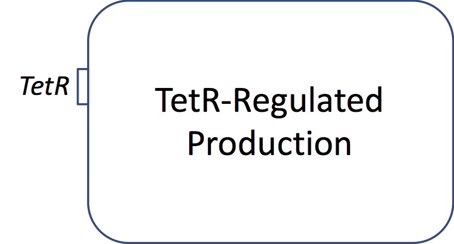

Ports connected to module internals via mappings:
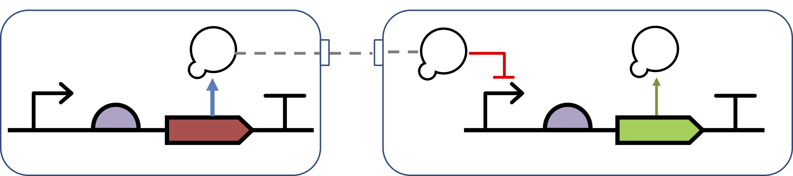

Boundary-crossing interaction passing through a port: 
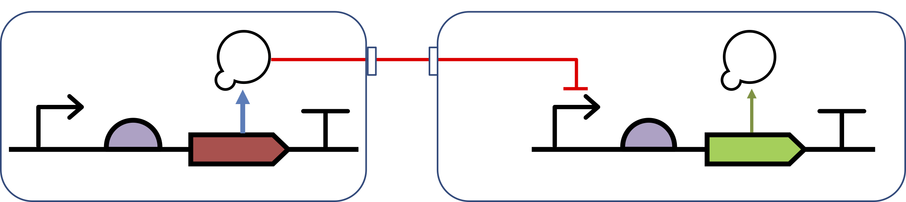

Diagrams SHOULD NOT mix mappings and interactions on a give port:
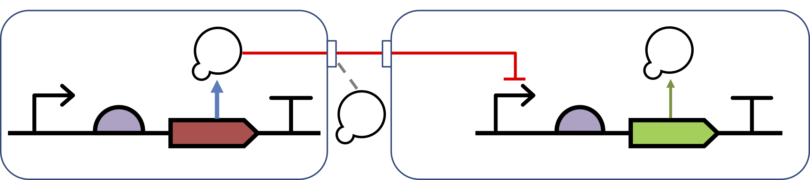

Ports MUST NOT be disconnected from their associated glyphs:
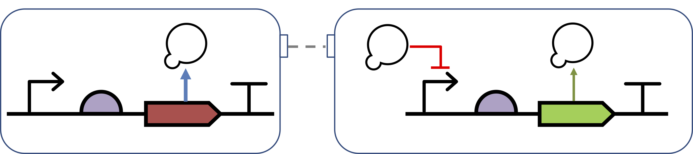

If a port exists, interactions with that port MUST NOT cross the boundary at any other location:

## 3. Examples 

Examples are embedded in the specification above.

## 4. Backwards Compatibility 

Modules have previously been undefined, so there are no backwards compatibility issues.

## 5. Discussion 

This SEP is intentionally drafted in a very permissive way, as there are several reasonable ways to represent a module. However, the community may feel that it should be more prescriptive in places.

In particular, some have suggested that it should be REQUIRED to represent MapsTo lines with dashed lines; others object to this as a departure from the previous policy of leaving choice about line style to the user. 

## Copyright 

  
   
  To the extent possible under law,
  <a rel="dct:publisher"
     href="sbolstandard.org">
    SBOL developers</a>
  has waived all copyright and related or neighboring rights to
  SEP V001.
This work is published from:

  United States.

