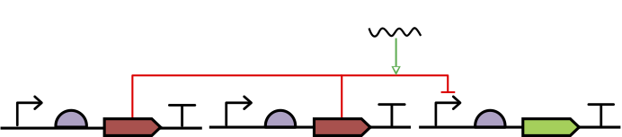
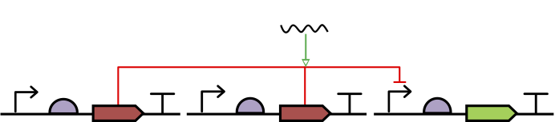
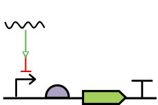

# SEP V018: Interactions with Interaction Nodes

| SEP | |
| --- | --- |
| **Authors** | Jacob Beal (jakebeal@ieee.org) |
| **Editor** | TBD |
| **Type** | Specification |
| **SBOL Visual Version** | 2.2 |
| **Status** | Draft |
| **Created** | 5-Oct-2019 |
| **Last modified** | 5-Oct-2019 |
| **Issue**         | https://github.com/SynBioDex/SBOL-visual/issues/73 |

## Abstract

Many diagrams in practice include "interactions with interactions."
This SEP establishes the circumstances in which such a form is allowed.

## Table of Contents  <remove TOC if SEP is rather short>
- [1. Rationale](#rationale) 
- [2. Specification](#specification)
- [3. Example or Use Case](#example)
- [4. Backwards Compatibility](#compatibility)
- [5. Discussion](#discussion)
- [References](#references)
- [Copyright](#copyright)

## 1. Rationale 

Many practitioners draw diagrams that include "interactions with interactions", such as an inducer molecule stimulating a repression interaction.

This practice can be made compatible with SBOL Visual by allowing edges into a process node to have arrowheads that specify their role, then identifying the circumstances under which the process node can be omitted unambiguously.

## 2. Specification 

Section 6.4 (Interaction) of the specification will have the following item added:

> * An edge entering an edge junction may have an interaction arrow head (i.e., glyph from Appendix A.3) to indicate the role its connected object plays in the biochemical process. If there is precisely one incoming edge without a head and precisely one outgoing edge, then the process node MAY be omitted, but otherwise MUST NOT be omitted. Examples are provided in Figure 19.

where Appendix A.3 is the collection of Interaction glyphs, and Figure 19 has examples of edges going into process nodes:

> (a) gRNA stimulating the Cas9m repression process (an alternative Figure~\ref{exa:4d}(e) representation),  
> 
> (b) the same but omitting the process node.
> 
> The process node MUST NOT be omitted when there are more (c) or less (d) than one incoming and one outgoing edge.
> 

## 3. Examples 

See above examples to be included in the specification.

## 4. Backwards Compatibility 

This change is backward compatible, as all previous diagrams are still valid with the same meaning.

## 5. Discussion 

TBD

## Copyright 

  
   
  To the extent possible under law,
  <a rel="dct:publisher"
     href="sbolstandard.org">
    SBOL developers</a>
  has waived all copyright and related or neighboring rights to
  SEP V018.
This work is published from:

  United States.

