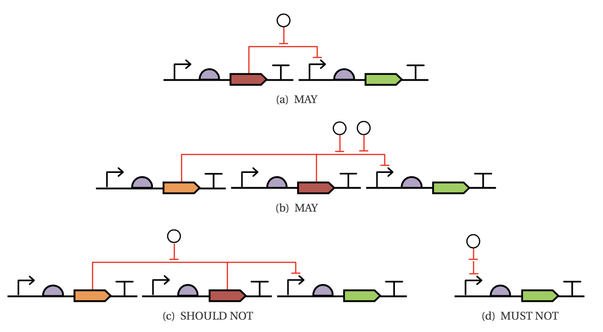

# SEP V018: Interactions with Interaction Nodes

| SEP | |
| --- | --- |
| **Title** | Interactions with Interaction Nodes |
| **Authors** | Jacob Beal (jakebeal@ieee.org) |
| **Editor** | TBD |
| **Type** | Specification |
| **SBOL Visual Version** | 2.3 |
| **Status** | Draft |
| **Created** | 5-Oct-2019 |
| **Last modified** | 18-Oct-2020 |
| **Issue**         | https://github.com/SynBioDex/SBOL-visual/issues/73 |

## Abstract

Many diagrams in practice include "interactions with interactions."
This SEP establishes the circumstances in which such a form is allowed.

## Table of Contents  <remove TOC if SEP is rather short>
- [1. Rationale](#rationale) 
- [2. Specification](#specification)
- [3. Example or Use Case](#example)
- [4. Backwards Compatibility](#compatibility)
- [5. Discussion](#discussion)
- [References](#references)
- [Copyright](#copyright)

## 1. Rationale 

Many practitioners draw diagrams that include "interactions with interactions", such as an inducer molecule stimulating a repression interaction.

In the Systems Biology Ontology, the categories of relationships and roles are not exclusive.  Thus, it is possible, for example, for an inhibition relationship to itself be a target of inhibition. This is taken advantage of in other standards already: the SBGN ER langauge explicitly allows relations to modulate other relations. We therefore propose to simply allow this to be done with SBOL Visual as well.

Note that this will allow diagrams that _cannot_ be represented directly in the SBOL 2 data model, though this will be able to be represented in SBOL 3 if [SEP 049](https://github.com/SynBioDex/SEPs/blob/master/sep_049.md) is accepted.

Consideration of this change also revealed some shortcomings in the previous definition of interaction nodes, which are also to be clarified.

## 2. Specification 

### Expand Definition of Glyph Classes

In Section 4 of the specification, the first sentence defining interaction glyphs will be changed from:

> Interaction Glyphs are ``arrows'' indicating functional relationships between sequence features and/or molecular species.

to:

> Interaction Glyphs are ``arrows'' indicating functional relationships between sequence features, molecular species, and/or other relationships.

### Disentangle multi-arrow and interaction node definitions

In Section 5.4 (Interaction) of the specification, the following sentence defining interaction nodes will be moved from item 5.4.3 (multi-head/multi-tail edges) to item 5.4.4 (interaction nodes), along with Figure 18(c) and 18(d):

> A glyph at the point where an edge splits or joins represents a biochemical process, i.e., an additional Interaction with type and roles set by the process glyph.

Figure 18(e) will be deleted, being replaced with the more specifically tailored Figure 20(b), shown in the next section.

> 
> Figure 18(e), to be deleted

### Meaning of arrows into / out of interaction nodes:

The following explanation of the meaning of arrows into or out of interaction nodes will be added as a new point 5.4.5:

> * An edge with its head at an interaction node MAY use an Interaction arrowhead to indicate a role other than Reactant (SBO:0000010) in the biochemical process. Likewise, an edge with its tail at an interaction node MAY use an Interaction arrow head to indicate the role played by that product of the biochemical process in another Interaction. Examples are provided in Figure 20.

> 

> Figure 20: (a) Example of interaction node with an additional role indicated by an entering arrow head: association of gRNA and Cas9 inhibited by the presence of a competing gRNA. (b) Example of interaction node whose product plays a role in another interaction: dCas9 and gRNA associate to form a CRISPR complex, which then represses a promoter.

### Interactions with Interactions

The following rules regarding interactions with interactions will be added as a new point 5.4.6:

> * An edge MAY have another edge at its head or tail, indicating that the interaction has a participant that is another interaction.
>	This does not have a direct representation in the SBOL 2 data model.
>	To avoid ambiguity, an edge SHOULD NOT connect to only one head of a multi-head arrow or one tail of a multi-tail arrow, and MUST connect only to the body of the edge, not its head or tail.
>	Examples are provided in Figure 21.

> 

> Figure 21: Examples of allowed and forbidden use of interactions with interactions: 
>	(a) aTc inhibiting repression by TetR.
>	(b) Multiple inhibitions of an interaction with two tails.
>	(c) Interactions SHOULD NOT connect to only one head of a multi-head or tail of a multi-tail interaction.
>	(d) interactions MUST NOT connect to the head or tail of another interaction.

## 3. Examples 

See above examples to be included in the specification.

## 4. Backwards Compatibility 

This change is backward compatible, as all previous diagrams are still valid with the same meaning.

## 5. Discussion 

Two other approaches were originally considered, both of which turned out to be both more complicated and less expressive:

1. The original concept of this approach was to have interactions with interactions imply a pattern equivalent to expansion with an additional interaction node.
2. The second approach was to have an interaction with an interaction imply an unspecified species instead, which would be the target of the interaction. This was more coherent than the first approach, but overly complex and limiting.

Once discussion revealed that SBO relationships are roles were not exclusive, this approach became possible. It is desirable over the others, as it allows the diagram to be interpreted directly rather than requiring it to be expanded into a hidden equivalent form.

Also discussed, but deferred for separate consideration:

* Should we reverse the ban on multi-head arrows having more than one type of head? (See: Section 5.4.3)

## Copyright 

  
   
  To the extent possible under law,
  <a rel="dct:publisher"
     href="sbolstandard.org">
    SBOL developers</a>
  has waived all copyright and related or neighboring rights to
  SEP V018.
This work is published from:

  United States.

