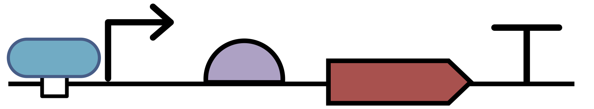
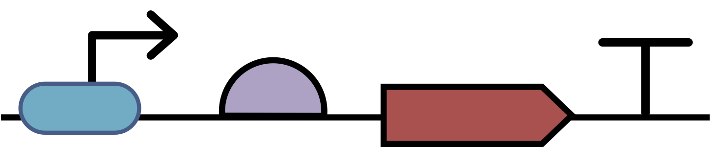
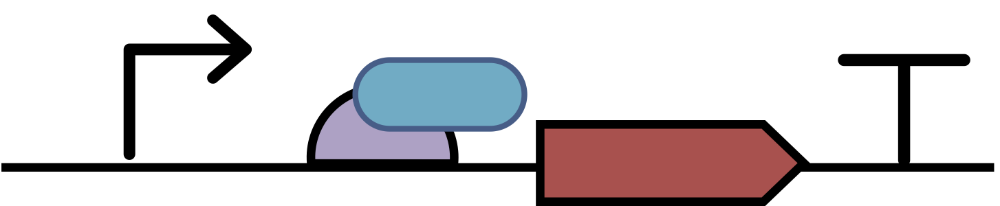

# SEP V019: Allow Complex to Include DNA Backbone

| SEP | |
| --- | --- |
| **Authors** | Jacob Beal (jakebeal@ieee.org), John Sexton |
| **Editor** | TBD |
| **Type** | Specification |
| **SBOL Visual Version** | 2.2 |
| **Status** | Draft |
| **Created** | 6-Oct-2019 |
| **Last modified** | 2-Oct-2020 |
| **Issue**         | https://github.com/SynBioDex/SBOL-visual/issues/74 |

## Abstract

A molecular species in contact with a DNA backbone is often used to show binding into a complex in a diagram.  This SEP proposes a modification to support such diagrams.

## Table of Contents  <remove TOC if SEP is rather short>
- [1. Rationale](#rationale) 
- [2. Specification](#specification)
- [3. Example or Use Case](#example)
- [4. Backwards Compatibility](#compatibility)
- [5. Discussion](#discussion)
- [References](#references)
- [Copyright](#copyright)

## 1. Rationale 

A molecular species in contact with a DNA backbone is often used to show binding into a complex in a diagram, such as a protein binding with a promoter in order to activate or repress that promoter.

This practice can be made compatible with SBOL Visual by allowing the Complex glyph to include NA glyphs and changing the specification to no longer forbid contact of with NA diagrams.

## 2. Specification 

### Specification Change

Section 6.3 (Molecular Species) will change item 1 from:

> 1. A molecular species glyph MUST NOT contact any nucleic acid backbone with any part of its bounding box.

to become:

> 1. The bounding box of a molecular species glyph MUST NOT contact any nucleic acid construct unless there is an interaction between the molecular species and the nucleic acid construct.
> 2. If a molecular species glyph overlaps a nucleic acid construct, then the location of the overlap SHOULD correspond with the location of an interaction on the nucleic acid construct. The molecular species glyph SHOULD be visually distinct from a sequence feature glyph. This location is RECOMMENDED to be represented with a sequence feature glyph appropriate to the interaction (e.g., a binding site or restriction site). Examples are provided in Figure 15.

> 
> 
> 
> Figure 15: Examples of recommended, allowed, and not recommended representation of an interaction between a molecular species and a nucleic acid construct, in this case regulation of a promoter by a transcription factor protein that binds on the 5’ side of the promoter: (a) shows the RECOMMENDED representation, (b) shows a more generic alternative, and (c) is recommended against because the location does not corresponding with the binding.

### Change to Complex Glyph

The Complex glyph will have the following section added:

> This may also be applied to show complex formation (binding) of a molecule to a nucleic acid construct by compositing the molecule glyph with the appropriate portion of the nucleic acid construct. For example, a protein binding to the promoter of a transcriptional unit:

> 

## 3. Examples 

See above examples to be included.

## 4. Backwards Compatibility 

This change is backward compatible, as all previous diagrams are still valid with the same meaning.

## 5. Discussion 

Discussion resulted in clarification of the original wording.

## Copyright 

  
   
  To the extent possible under law,
  <a rel="dct:publisher"
     href="sbolstandard.org">
    SBOL developers</a>
  has waived all copyright and related or neighboring rights to
  SEP V019.
This work is published from:

  United States.

