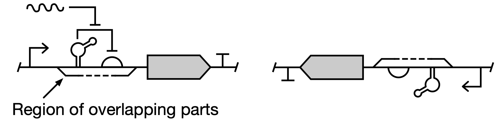
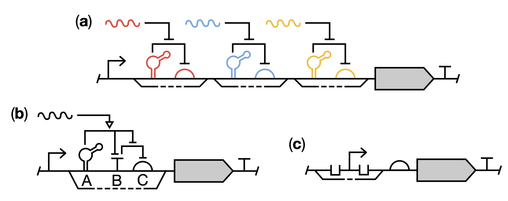

# SEP V025: Handle nucleic acid parts with overlapping sequences

| SEP | |
| --- | --- |
| **Title** | Handle nucleic acid parts with overlapping sequences |
| **Authors** | Thomas Gorochowski (tom@chofski.co.uk) |
| **Editor** | James Scott Brown |
| **Type** | Specification |
| **SBOL Visual Version** | 3.0 |
| **Status** | Draft |
| **Created** | 7-Oct-2022 |
| **Last modified** | 7-Oct-2022 |
| **Issue** | [#165](https://github.com/SynBioDex/SBOL-visual/issues/165) |

## Abstract

This SEP presents the proposed change to SBOL Visual 3.0 to enable the representation of nucleic acid parts with overlapping sequences.

## 1. Rationale 

There are cases where numerous nucleic acid parts are encoded by overlapping sequences to function as a single entity. There is a need to be able to clearly describe in diagrams the role of these composite parts as a single connected entity and support the visual depiction of functional interactions between the numerous nucleic acid features within these regions. These types of part are common in RNA-based regulatory circuits due to the fact that RNA aptamers are often encoded within other genetic parts to allow for control of function via other interacting RNAs, small molecules, or proteins. This change will help support the expansion of SBOL Visual in RNA-based synthetic biology and ensure the language is sufficiently expressive to capture core use cases from this community.

## 2. Specification 

This SEP recommends a minor addition to the standard to allow for composite and overlapping parts to be explicitly shown. We propose to allow for a new visual annotation to DNA/RNA backbones that cover the region of the backbone where a group of nucleic acid glyphs have overlapping sequences. Glyphs within the region can be in any order and there are no guarantees provided as to their relative position. This is due to the fact that parts could have identical start points, making it impossible to order them in any logical way. The annotation we propose is a parallel dashed line to the backbone with solid angled connectors at the ends that link to the backbone itself and define the start and end of the region. The annotation can be above or below the backbone.

The examples below show an overlapping aptamer and ribosome binding site in the forward (left) and reverse (right) directions. Although the ordering of the elements within the overlapping region is not known, it is still possible to have functional interactions between the elements and to external components (e.g. small RNAs shown on the left example).

Below are some additional examples of the annotation in use. (**a**) A backbone can contain many separated regions of overlapping parts as found in RNA-based computational devices (Green _et al._ _Nature_ 548, 117–121, 2017). (**b**) RNA-based regulatory parts can contain many internal functional interactions that are affected by external components like small RNAs (Westbrook _et al._ _Nucleic Acids Research_ 45, 5614–5624, 2017). (**c**) In addition to RNA-based regulatory parts, the ability to represent overlapping elements provides a means to show multiple operator sites that are commonly present within promoters.

## 3. Examples 

Examples are embedded in the text as needed above.

## 4. Backwards Compatibility 

This change is fully backward compatible. Only new visual annotations are suggested.

## 5. Discussion 

See Issue #155.

## Copyright 

  
   
  To the extent possible under law,
  <a rel="dct:publisher"
     href="sbolstandard.org">
    SBOL developers</a>
  has waived all copyright and related or neighboring rights to
  SEP V025.
This work is published from:

  United States.

