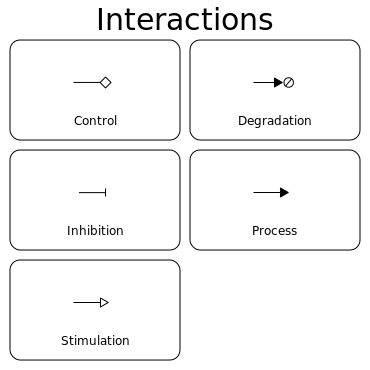

# Glyph Sampler

This directory contains PNG/PDF/SVG sampler images showing the glyphs of a particular type.

It's contents are automatically generated by the script [`scripts/generate_sampler.py`](../scripts/generate_sampler.py).

## Functional Components

## Species

## Interactions

## Interaction Nodes

